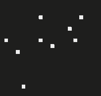
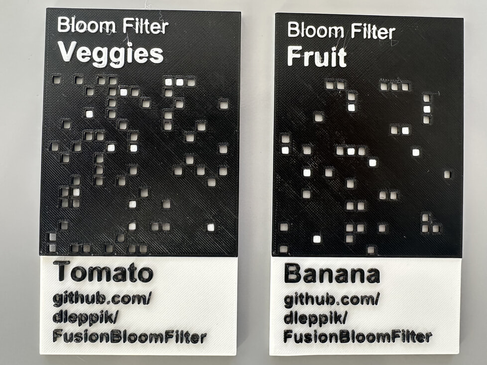

# Fusion Bloom Filter

### A 3D-printable Bloom filter

In the form of Fusion 360 Python plugin code.

![alt text][fruitAndVeggieFilter]

## What the heck is a Bloom filter?

A Bloom filter is a space-efficient data structure similar to a set except that it can have
false positives but not false negatives. That is, it is possible for an item to erroneously
be allowed by the filter, but it will never erroneously reject items.

Bloom filters are often used in caches to avoid expensive look-ups when a large percentage of
queries are for things that aren't in the cache. They can also be used when there isn't enough
space to store the whole collection and an occasional false positive is tolerable. For example,
before computers had enough memory to hold a dictionary, spellcheckers relied on Bloom filters.

## How does a Bloom filter work?

Boom filters are based on hashes. A hash is a number derived from data that can be used to
approximately identify that data. That data can be anything from a word to a large file, but
the hash is typically fixed-length. Because the hash can be arbitrarily smaller than the
original data, [multiple items with the same hash can exist.][pidgeonhole] When two items 
share a hash, that's called a hash collision.

A Bloom filter is essentially a multi-item hash. In its simplest form, you build the hash by 
OR-ing multiple hashes together. An item is said to pass the filter if you OR its hash with 
the filter and the result is identical to the filter. Put another way, the item passes the
filter if all its 1 bits are also 1s in the filter.

You can't just use a normal hash because every bit in a high-quality hash is equally likely
to be 1 or 0. If you OR a bunch of hashes together, you quickly get all 1s. So you need
to use a sparse hash.

Bloom filters generate sparse hashes by combining multiple hash algorithms. That's a lot easier
than it sounds because it's trivial to derive a new hash algorithm from an existing algorithm.

For this Bloom filter, we start with SHA-256, an algorithm that produces 256-bit (32-byte)
hashes. We can slice the 256-bit hash into up to 32 8-bit (1-byte) hashes—though 10 hashes
is plenty.

Each 1-byte hash can be thought of as a number between 0 and 255. We construct a 16x16 pixel
grid where each number between 0 and 255—and therefore each hash value—has a corresponding
pixel. By representing an item with a 1-byte hash, we set up to 10 bits. For example, the
word "Banana" has a sparse hash which looks like this:

From here, we can combine sparse hashes to form a Bloom filter. We print the filters as punchcards
and item hashes as cards with pixel pegs. The end result, in 3D printable form, looks like this:

[fruitAndVeggieFilter]: docResources/FruitsAndVeggies.jpeg "Two 3D printed Bloom filters consisting of a black square plastic punchcard labeled Veggies and Fruit"
[pidgeonhole]: https://en.wikipedia.org/wiki/Pigeonhole_principle: